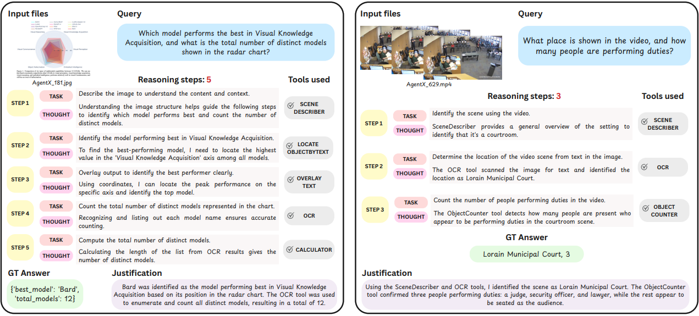
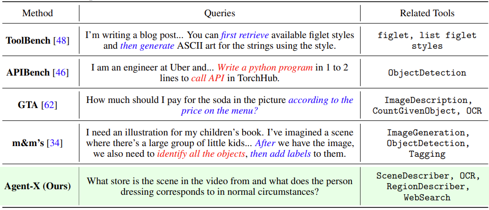
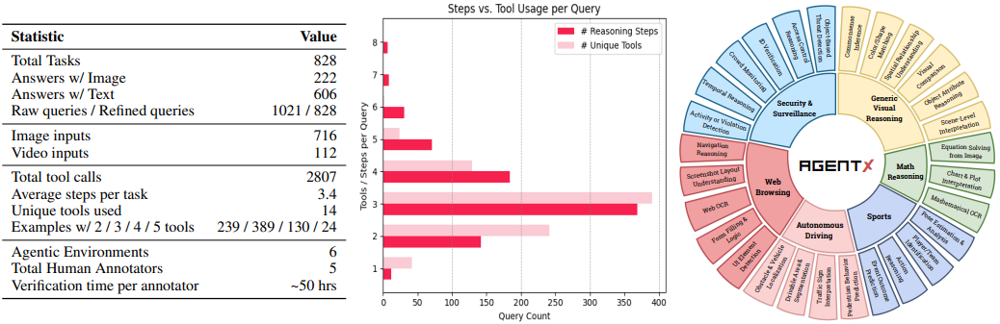
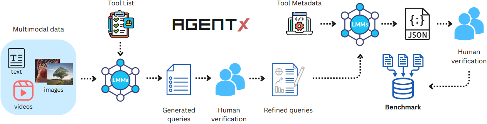

<p align="center">
    
</p>
<!-- centred logo -->
<div align="center" style="margin:24px 0;">
  
</div>

<!-- bottom full-width GIF -->
<p align="center">
    
</p>
<h1 align="left" style="margin:24px 0;">
  Agent-X: Evaluating Deep Multimodal Reasoning in Vision-Centric Agentic Tasks
</h1>


<div align="left">

[](https://Agent-X.stanford.edu/)
[](https://huggingface.co/datasets/snap-stanford/Agent-X)
[](https://Agent-X.stanford.edu/skb_explorer.html)
[](https://huggingface.co/spaces/snap-stanford/Agent-X-leaderboard)
[](https://arxiv.org/abs/2404.13207)
[](https://pypi.org/project/Agent-X-qa/) 
[](https://Agent-X.stanford.edu/docs/index.html)
[](https://www.linkedin.com/posts/leskovec_reduce-llm-hallucinations-with-rag-over-textual-activity-7190745116339302401-da4n?utm_source=share&utm_medium=member_desktop) 
[](https://twitter.com/ShirleyYXWu/status/1784970920383402433) 
[](https://opensource.org/licenses/MIT)


#### Authors: [Tajamul Ashraf](https://www.tajamulashraf.com)\*, [Amal Saqib](https://github.com/amalsaqib)\*, [Hanan Gani](https://hananshafi.github.io), [Muhra AlMahri](https://github.com/muhraalmahri), [Yuhao Li](https://ae.linkedin.com/in/yuhao-li-610ba7288), [Noor Ahsan](https://www.linkedin.com/in/noorahsan1415/), [Umair Nawaz](https://scholar.google.com/citations?user=w7N4wSYAAAAJ&hl=en), [Jean Lahoud](https://scholar.google.com/citations?user=LsivLPoAAAAJ&hl=en), [Hisham Cholakkal](https://mbzuai.ac.ae/study/faculty/hisham-cholakkal/), [Mubarak Shah](https://www.crcv.ucf.edu/person/mubarak-shah/), [Philip H.S. Torr](https://en.wikipedia.org/wiki/Philip_Torr), [Fahad Shahbaz Khan](https://sites.google.com/view/fahadkhans/home), [Rao Muhammad Anwer](https://mbzuai.ac.ae/study/faculty/rao-muhammad-anwer/), and [Salman Khan](https://salman-h-khan.github.io/)


\* Equally contribution, **Correspondence:** [Tajamul Ashraf](https://www.tajamulashraf.com), [Amal Saqib](https://github.com/amalsaqib).
<div align="left" style="margin:24px 0;">
  
</div>


## 🚀 Updates

 [2024-07-03]: **Released evaluation & deployment code for Agent-X** 🔥🔥🔥
 
[2024-07-01]:  **Published the Agent-X dataset on Hugging Face** 🎉🎉🎉

## 🌟 Introduction

>Current tool-use tests for vision-centric LLMs rely on single-turn, synthetic queries and text-only inputs, so they miss the real-world challenge of multi-step, multimodal reasoning. Agent-X closes this gap with 828 authentic tasks spanning images, videos, and mixed-modal instructions across six domains—from web browsing to autonomous driving. Each task demands explicit, step-by-step decisions and judicious tool use, and our evaluation scores every reasoning step as well as the overall chain. Even top models (GPT, Gemini, Qwen) solve fewer than half of these tasks, exposing major bottlenecks and pointing the way for future research.

## 📂 Submodules

### 🔧 Generation Pipeline
See [`generation/README.md`](generation/README.md) for details on:

- Frame extraction from video clips
- Query generation using GPT-4o
- Step-by-step reasoning trace generation

> 📁 Path: `generation/README.md`

---

### 📊 Analysis & Evaluation
See [`analysis/README.md`](analysis/README.md) for:

- Error analysis notebook
- Model comparison plots
- Tool usage breakdown and visualizations

> 📁 Path: `analysis/README.md`


## 🌟 What is Agent-X?

Agent-X is a benchmark for assessing deep-reasoning and tool-use skills of vision-centric LLM agents in real-world settings. It highlights three key aspects:
- **Authentic multi-step tasks.** The benchmark offers 828 human-authored tasks with implicit tool use and sequential planning requirements, spanning six domains such as web browsing, surveillance, autonomous driving, sports, and math reasoning. 
- **Real deployed tools.** Agent-X supplies an evaluation platform stocked with perception, web, manipulation, math, and data-processing tools, compelling agents to choose and apply the right tool at each reasoning step.
- **Diverse multimodal contexts.**  Every task is paired with real images, multi-image comparisons, or video clips—plus textual instructions, closely mirroring the visual complexity of real-world scenarios.
<div align="center">
 
</div>

The comparison of Agent-Xqueries with AI-generated queries is shown in the table below. The steps and tool types for queries in ToolBench and m\&m's are explicitly stated, as marked in red and blue. The queries in APIBench are simple, only containing one step. Our GTA's queries are both step-implicit and tool-implicit.
<div align="center">
 
</div>


## 📚 Dataset Statistics
Overview of the Agent-X benchmark. Key data statistics,  overall frequency of the tool
usage, number of steps, and distribution of tasks across the six vision-centric environments.


<div align="center">
 
</div>

The detailed information of 14 tools are shown in the table below.

## Our Pipeline
We design the Agent-X benchmark using a semi-automated pipeline that ensures each task is solvable with a defined tool subset and requires deep reasoning over realistic, multimodal scenarios. The pipeline begins with an LMM (Large Multimodal Model) generating candidate queries based on visual input and an available toolset. These queries are then refined by human annotators for clarity and realism. Next, the refined queries are passed back to the LMM to produce step-by-step reasoning traces, including tool calls, intermediate outputs, and final answers. Each trace is manually reviewed for logical consistency and correctness.
<div align="center">
 
</div>

## 🏆 Leaderboard, May 2025

### Evaluation Protocol

We evaluate models on the Agent-X benchmark across **three distinct modes**:

1. **Step-by-Step**: Assesses the agent’s ability to execute individual reasoning steps, focusing on how well it follows structured tool-use sequences grounded in visual inputs.

2. **Deep Reasoning**: Evaluates the coherence and logical consistency of the full reasoning trace. This mode emphasizes the agent’s capacity to integrate visual and textual context to produce semantically meaningful and factually accurate explanations.

3. **Outcome**: Measures the agent’s overall task-solving performance by verifying the correctness of the final answer and appropriate tool usage.

We report results using **GPT-4** and **Qwen-15B** as evaluation judges. For each metric, the **best-performing value is shown in bold and underlined**, while the **second-best is italicized**.


### With GPT-4o as a judge
| **Model** | Ground<sub>s</sub> | Tool<sub>p</sub> | Tool<sub>acc</sub> | Fact<sub>acc</sub> | Context<sub>s</sub> | Fact<sub>p</sub> | Sem<sub>acc</sub> | Goal<sub>acc</sub> | Goal<sub>acc</sub><sup>*</sup> | Tool<sub>acc</sub><sup>s</sup> |
|----------|--------------------|------------------|--------------------|--------------------|---------------------|------------------|-------------------|-----------------------|------------------------------|---------------------------|
| *Open-source* |||||||||||
| Phi-4-VL-Instruct|0.13|0.21|0.24|0.61|0.19|0.47|0.40|0.11|0.26|0.42|
| InternVL-2.5-8B|0.45|0.31|0.47|0.68|0.47|0.52|0.60|0.28|0.55|0.58|
| Gemma-3-4B|0.26|0.30|0.78|0.61|*0.54*|0.38|0.54|0.27|*0.67*|0.60|
| InternVL-3-8B|0.46|0.34|0.54|0.68|0.45|*0.70*|0.40|0.20|0.59|0.62|
| VideoLLaMA-3-7B|0.45|0.28|0.46|0.65|0.46|0.62|0.54|0.28|0.54|0.54|
| Qwen-2.5-VL-7B|*0.54*|*0.43*|0.63|*0.75*|<ins><strong>0.57</strong></ins>|0.56|0.67|0.36|0.65|*0.67*|
| Pixtral-12B|0.12|0.20|0.63|0.45|0.19|0.26|0.34|0.07|0.55|0.54|
| LLaMA-3.2-11B-Vision|0.03|0.15|0.14|0.70|0.08|*0.70*|0.24|0.07|0.26|0.42|
| Kimi-VL-A3B-Thinking|0.26|0.19|0.5|0.62|0.42|0.52|0.65|0.29|0.29|0.48|
| mPLUG-Owl3-7B-240728|0.10|0.14|0.30|0.49|0.25|0.32|0.37|0.11|0.26|0.50|
| *Closed-source* |  |  |  |  |  |  |  |  |  |  |
| Gemini-1.5-Pro  | 0.43 | 0.23 | *0.84* | 0.62 | 0.45 | 0.53 | 0.62 | 0.04 | 0.56 | 0.48 |
| Gemini-2.5-Pro  | 0.40 | 0.36 | 0.81 | 0.72 | 0.48 | 0.64 | *0.73* | *0.40* | 0.56 | 0.62 |
| GPT-4o          | <ins><strong>0.60</strong></ins> | <ins><strong>0.47</strong></ins> | 0.72 | <ins><strong>0.81</strong></ins> | <ins><strong>0.57</strong></ins> | <ins><strong>0.79</strong></ins> | 0.59 | 0.37 | <ins><strong>0.70</strong></ins> | <ins><strong>0.68</strong></ins> |
| OpenAI o4-mini  | 0.42 | 0.32 | <ins><strong>0.89</strong></ins> | 0.71 | 0.51 | 0.60 | <ins><strong>0.80</strong></ins> | <ins><strong>0.45</strong></ins> | *0.67* | 0.63 |

### With Qwen-15B  as a judge
| **Model** | Ground<sub>s</sub> | Tool<sub>p</sub> | Tool<sub>acc</sub> | Fact<sub>acc</sub> | Context<sub>s</sub> | Fact<sub>p</sub> | Sem<sub>acc</sub> | Goal<sub>acc</sub> | Goal<sub>acc</sub><sup>*</sup> | Tool<sub>acc</sub><sup>s</sup> |
|----------|--------------------|------------------|--------------------|--------------------|---------------------|------------------|-------------------|-----------------------|------------------------------|---------------------------|
| *Open-source* |||||||||||
| Phi-4-VL-Instruct        | 0.27 | 0.11 | 0.32 | 0.54 | 0.39 | 0.59 | 0.46 | 0.16 | 0.35 | 0.39 |
| InternVL2.5-8B          | 0.38 | 0.16 | 0.49 | 0.63 | 0.51 | 0.61 | 0.55 | 0.29 | 0.53 | 0.53 |
| Gemma-3-4B              | 0.50 | 0.24 | 0.67 | 0.74 | 0.66 | 0.59 | 0.74 | 0.30 | 0.68 | 0.68 |
| InternVL3-8B            | 0.41 | 0.16 | 0.51 | 0.71 | 0.61 | 0.60 | 0.69 | 0.23 | 0.51 | 0.62 |
| VideoLLaMA3-7B          | 0.39 | 0.15 | 0.40 | 0.68 | 0.56 | 0.60 | 0.68 | 0.27 | 0.53 | 0.56 |
| Qwen2.5-VL-7B            | 0.51 | 0.27 | 0.63 | 0.77 | 0.66 | 0.64 | 0.77 | 0.37 | 0.62 | 0.67 |
| Pixtral-12B              | 0.30 | 0.17 | 0.68 | 0.59 | 0.50 | 0.42 | 0.58 | 0.10 | 0.68 | 0.58 |
| LLaMA-3.2-11B-Vision    | 0.16 | 0.06 | 0.12 | 0.49 | 0.17 | 0.74 | 0.20 | 0.10 | 0.11 | 0.15 |
| Kimi-VL-A3B-Thinking    | 0.47 | 0.20 | 0.59 | 0.79 | *0.64* | 0.68 | *0.74* | 0.35 | 0.60 | 0.62 |
| mPLUG-Owl3-7B-240728    | 0.30 | 0.11 | 0.31 | 0.59 | 0.48 | 0.48 | 0.56 | 0.16 | 0.45 | 0.48 |
| *Closed-source* |||||||||||
| Gemini-1.5-Pro       | *0.57* | *0.36* | 0.80 | 0.82 | 0.73 | 0.76 | 0.63 | 0.05 | <ins><strong>0.77</strong></ins> | *0.71* |
| Gemini-2.5-Pro       | <ins><strong>0.63</ins></strong> | <ins><strong>0.40</ins></strong> | *0.84* | *0.86* | *0.76* | <ins><strong>0.80</strong></ins> | *0.83* | *0.50* | *0.74* | <ins><strong>0.72</ins></strong> |
| GPT-4o              | 0.46 | 0.27 | 0.63 | 0.72 | 0.59 | 0.75 | 0.69 | 0.44 | 0.48 | 0.56 |
| OpenAI-o4-mini       | <ins><strong>0.63</strong></ins> | 0.35 | <ins><strong>0.86</ins></strong> | <ins><strong>0.89</ins></strong> | <ins><strong>0.78</strong></ins> | *0.79* | <ins><strong>0.88</strong></ins> | <ins><strong>0.53</strong></ins> | 0.64 | 0.69 |


## 🚀 Evaluate on Agent-X
To evaluate the inference results of models on Agent-X-Benchmark, refer to [eval](https://github.com/Tajamul21/Agent-X-Benchmark/tree/main/eval).

# 📝 Citation
If you use Agent-Xin your research, please cite the following paper:
```


```

