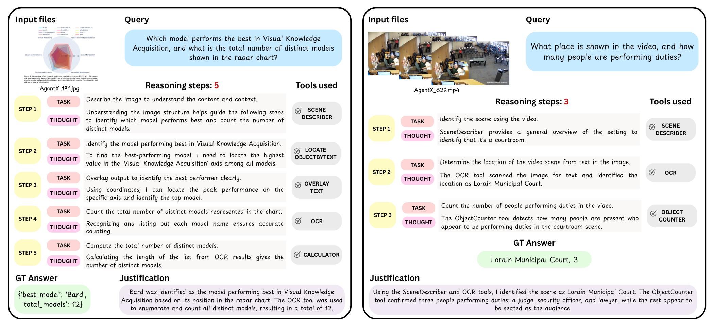
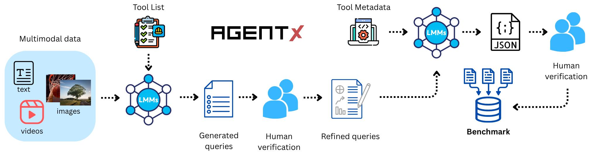

<p align="center">
    
</p>
<!-- centred logo -->
<div align="center" style="margin:24px 0;">
  
</div>

<!-- bottom full-width GIF -->
<p align="center">
    
</p>
<h1 align="left" style="margin:24px 0;">
  Agent-X: Evaluating Deep Multimodal Reasoning in Vision-Centric Agentic Tasks
</h1>


<div align="left">

[](https://Agent-X.stanford.edu/)
[](https://huggingface.co/datasets/snap-stanford/Agent-X)
[](https://Agent-X.stanford.edu/skb_explorer.html)
[](https://huggingface.co/spaces/snap-stanford/Agent-X-leaderboard)
[](https://arxiv.org/abs/2404.13207)
[](https://pypi.org/project/Agent-X-qa/) 
[](https://Agent-X.stanford.edu/docs/index.html)
[](https://www.linkedin.com/posts/leskovec_reduce-llm-hallucinations-with-rag-over-textual-activity-7190745116339302401-da4n?utm_source=share&utm_medium=member_desktop) 
[](https://twitter.com/ShirleyYXWu/status/1784970920383402433) 
[](https://opensource.org/licenses/MIT)


#### Authors: [Tajamul Ashraf](https://www.tajamulashraf.com)\*, [Amal Saqib](https://github.com/amalsaqib)\*, [Hanan Ghani](https://github.com/hananshafi), [Muhra AlMahri](https://github.com/muhraalmahri), [Yuhao Li](https://ae.linkedin.com/in/yuhao-li-610ba7288), [Noor Ahsan](https://www.linkedin.com/in/noorahsan1415/), [Umair Nawaz](https://scholar.google.com/citations?user=w7N4wSYAAAAJ&hl=en), [Jean Lahoud](https://scholar.google.com/citations?user=LsivLPoAAAAJ&hl=en), [Hisham Cholakkal](https://mbzuai.ac.ae/study/faculty/hisham-cholakkal/), [Mubarak Shah](https://www.crcv.ucf.edu/person/mubarak-shah/), [Philip H.S. Torr](https://en.wikipedia.org/wiki/Philip_Torr), [Fahad Shahbaz Khan](https://sites.google.com/view/fahadkhans/home), [Rao Muhammad Anwer](https://mbzuai.ac.ae/study/faculty/rao-muhammad-anwer/), [Salman Khan](https://salman-h-khan.github.io/)


\* Equally contribution, **Correspondence:** [Tajamul Ashraf](https://www.tajamulashraf.com), [Amal Saqib](https://github.com/amalsaqib).
<div align="left" style="margin:24px 0;">
  
</div>


## 🚀 Updates

 [2024-07-03]: **Released evaluation & deployment code for Agent-X** 🔥🔥🔥
 
[2024-07-01]:  **Published the Agent-X dataset on Hugging Face** 🎉🎉🎉

## 🌟 Introduction

>Current tool-use tests for vision-centric LLMs rely on single-turn, synthetic queries and text-only inputs, so they miss the real-world challenge of multi-step, multimodal reasoning. Agent-X closes this gap with 828 authentic tasks spanning images, videos, and mixed-modal instructions across six domains—from web browsing to autonomous driving. Each task demands explicit, step-by-step decisions and judicious tool use, and our evaluation scores every reasoning step as well as the overall chain. Even top models (GPT, Gemini, Qwen) solve fewer than half of these tasks, exposing major bottlenecks and pointing the way for future research.


## 🌟 What is Agent-X?

Agent-X is a benchmark for assessing deep-reasoning and tool-use skills of vision-centric LLM agents in real-world settings. It highlights three key aspects:
- **Authentic multi-step tasks.** The benchmark offers 828 human-authored tasks with implicit tool use and sequential planning requirements, spanning six domains such as web browsing, surveillance, autonomous driving, sports, and math reasoning. 
- **Real deployed tools.** Agent-X supplies an evaluation platform stocked with perception, web, manipulation, math, and data-processing tools, compelling agents to choose and apply the right tool at each reasoning step.
- **Diverse multimodal contexts.**  Every task is paired with real images, multi-image comparisons, or video clips—plus textual instructions, closely mirroring the visual complexity of real-world scenarios.
<div align="center">
 
</div>

The comparison of Agent-Xqueries with AI-generated queries is shown in the table below. The steps and tool types for queries in ToolBench and m\&m's are explicitly stated, as marked in red and blue. The queries in APIBench are simple, only containing one step. Our GTA's queries are both step-implicit and tool-implicit.
<div align="center">
 
</div>


## 📚 Dataset Statistics
Overview of the Agent-X benchmark. Key data statistics,  overall frequency of the tool
usage, number of steps, and distribution of tasks across the six vision-centric environments.


<div align="center">
 
</div>

The detailed information of 14 tools are shown in the table below.

<div align="center">
 
</div>

## 🏆 Leaderboard, July 2024

We evaluate the language models in two modes:
- **Step-by-step mode.** It is designed to evaluate the model's fine-grained tool-use capabilities. In this mode, the model is provided with the initial $n$ steps of the reference tool chain as prompts, with the expectation to predict the action in step $n+1$. Four metrics are devised under step-by-step mode: ***InstAcc*** (instruction following accuracy), ***ToolAcc*** (tool selection accuracy), ***ArgAcc*** (argument prediction accuracy), and ***SummAcc*** (answer summarizing accuracy).

- **End-to-end mode.** It is designed to reflect the tool agent's actual task executing performance. In this mode, the model actually calls the tools and solves the problem by itself. We use ***AnsAcc*** (final answer accuracy) to measure the accuracy of the execution result. Besides, we calculate four ***F1 scores of tool selection: P, L, O, C*** in perception, operation, logic, and creativity categories, to measure the tool selection capability. 

Here is the performance of various LLMs on GTA. Inst, Tool, Arg, Summ, and Ans denote InstAcc, ToolAcc, ArgAcc SummAcc, and AnsAcc, respectively. P, O, L, C denote the F1 score of tool selection in Perception, Operation, Logic, and Creativity categories. ***Bold*** denotes the best score among all models. <ins>*Underline*</ins> denotes the best score under the same model scale. ***AnsAcc*** reflects the overall performance.

### Overall Results on Agent-X

| **Model** | **G<sub>s</sub>** | **T<sub>p</sub>** | **T<sub>acc</sub>** | **F<sub>acc</sub>** | **C<sub>s</sub>** | **F<sub>p</sub>** | **S<sub>acc</sub>** | **G<sub>acc</sub>** | **G<sub>a</sub><sup>*</sup>** | **T<sub>acc</sub><sup>s</sup>** |
|-----------|-------|-------|--------|--------|-------|-------|--------|--------|--------|---------|
| *Open-source* |  |  |  |  |  |  |  |  |  |  |
| Phi-4-VL-Instruct | 0.13 | 0.21 | 0.24 | 0.61 | 0.19 | 0.47 | 0.40 | 0.11 | 0.26 | 0.42 |
| InternVL-2.5-8B | 0.45 | 0.31 | 0.47 | 0.68 | 0.47 | 0.52 | 0.60 | 0.28 | 0.55 | 0.58 |
| Gemma-3-4B | 0.26 | 0.30 | **0.78** | 0.61 | 0.54 | 0.38 | 0.54 | 0.27 | **0.67** | 0.60 |
| InternVL-3-8B | 0.46 | 0.34 | 0.54 | 0.68 | 0.45 | _**0.70**_ | 0.40 | 0.20 | 0.59 | 0.62 |
| VideoLLaMA-3-7B | 0.45 | 0.28 | 0.46 | 0.65 | 0.46 | 0.62 | 0.54 | 0.28 | 0.54 | 0.54 |
| Qwen-2.5-VL-7B | _**0.54**_ | _**0.43**_ | 0.63 | _**0.75**_ | **0.57** | 0.56 | **0.67** | 0.36 | _**0.65**_ | _**0.67**_ |
| *Closed-source* |  |  |  |  |  |  |  |  |  |  |
| Gemini-1.5-Pro | 0.43 | 0.23 | _**0.84**_ | 0.62 | 0.45 | 0.53 | 0.62 | 0.04 | 0.56 | 0.48 |
| Gemini-2.5-Pro | 0.40 | 0.36 | 0.81 | 0.72 | 0.48 | 0.64 | _**0.73**_ | 0.40 | 0.56 | 0.62 |
| GPT-4o | **0.60** | **0.47** | 0.72 | **0.81** | **0.57** | **0.79** | 0.59 | _**0.37**_ | **0.70** | **0.68** |
| OpenAI o4-mini | 0.42 | 0.32 | **0.89** | 0.71 | _**0.51**_ | 0.60 | **0.80** | **0.45** | _**0.67**_ | 0.63 |

*Best numbers are **bold**; second-best are _**bold-italic**_.*


## 🚀 Evaluate on GTA

### Prepare Agent-XDataset
1. Clone this repo.
```shell
git clone https://github.com/open-compass/GTA.git
cd GTA
```
2. Download the dataset from [release file](https://github.com/open-compass/GTA/releases/download/v0.1.0/gta_dataset.zip).
```shell
mkdir ./opencompass/data
```
Put it under the folder ```./opencompass/data/```. The structure of files should be:
```
GTA/
├── agentlego
├── opencompass
│   ├── data
│   │   ├── gta_dataset
│   ├── ...
├── ...
```

### Prepare Your Model
1. Download the model weights.
```shell
pip install -U huggingface_hub
# huggingface-cli download --resume-download hugging/face/repo/name --local-dir your/local/path --local-dir-use-symlinks False
huggingface-cli download --resume-download Qwen/Qwen1.5-7B-Chat --local-dir ~/models/qwen1.5-7b-chat --local-dir-use-symlinks False
```
2. Install [LMDeploy](https://github.com/InternLM/lmdeploy).
```shell
conda create -n lmdeploy python=3.10
conda activate lmdeploy
```
For CUDA 12:
```shell
pip install lmdeploy
```
For CUDA 11+:
```shell
export LMDEPLOY_VERSION=0.4.0
export PYTHON_VERSION=310
pip install https://github.com/InternLM/lmdeploy/releases/download/v${LMDEPLOY_VERSION}/lmdeploy-${LMDEPLOY_VERSION}+cu118-cp${PYTHON_VERSION}-cp${PYTHON_VERSION}-manylinux2014_x86_64.whl --extra-index-url https://download.pytorch.org/whl/cu118
```
3. Launch a model service.
```shell
# lmdeploy serve api_server path/to/your/model --server-port [port_number] --model-name [your_model_name]
lmdeploy serve api_server ~/models/qwen1.5-7b-chat --server-port 12580 --model-name qwen1.5-7b-chat
```
### Deploy Tools
1. Install [AgentLego](https://github.com/InternLM/agentlego).
```shell
conda create -n agentlego python=3.11.9
conda activate agentlego
cd agentlego
pip install -r requirements_all.txt
pip install agentlego
pip install -e .
mim install mmengine
mim install mmcv==2.1.0
```
Open ```~/anaconda3/envs/agentlego/lib/python3.11/site-packages/transformers/modeling_utils.py```, then set ```_supports_sdpa = False``` to ```_supports_sdpa = True``` in line 1279.

2. Deploy tools for Agent-Xbenchmark.

To use the GoogleSearch and MathOCR tools, you should first get the Serper API key from https://serper.dev, and the Mathpix API key from https://mathpix.com/. Then export these keys as environment variables.

```shell
export SERPER_API_KEY='your_serper_key_for_google_search_tool'
export MATHPIX_APP_ID='your_mathpix_key_for_mathocr_tool'
export MATHPIX_APP_KEY='your_mathpix_key_for_mathocr_tool'
```

Start the tool server.

```shell
agentlego-server start --port 16181 --extra ./benchmark.py  `cat benchmark_toollist.txt` --host 0.0.0.0
```
### Start Evaluation
1. Install [OpenCompass](https://github.com/open-compass/opencompass).
```shell
conda create --name opencompass python=3.10 pytorch torchvision pytorch-cuda -c nvidia -c pytorch -y
conda activate opencompass
cd agentlego
pip install -e .
cd ../opencompass
pip install -e .
```
huggingface_hub==0.25.2 (<0.26.0)
transformers==4.40.1
2. Modify the config file at ```configs/eval_gta_bench.py``` as below.

The ip and port number of **openai_api_base** is the ip of your model service and the port number you specified when using lmdeploy.

The ip and port number of **tool_server** is the ip of your tool service and the port number you specified when using agentlego.

```python
models = [
  dict(
        abbr='qwen1.5-7b-chat',
        type=LagentAgent,
        agent_type=ReAct,
        max_turn=10,
        llm=dict(
            type=OpenAI,
            path='qwen1.5-7b-chat',
            key='EMPTY',
            openai_api_base='http://10.140.1.17:12580/v1/chat/completions',
            query_per_second=1,
            max_seq_len=4096,
            stop='<|im_end|>',
        ),
        tool_server='http://10.140.0.138:16181',
        tool_meta='data/gta_dataset/toolmeta.json',
        batch_size=8,
    ),
]
```

If you infer and evaluate in **step-by-step** mode, you should comment out **tool_server** and enable **tool_meta** in ```configs/eval_gta_bench.py```, and set infer mode and eval mode to **every_with_gt** in ```configs/datasets/gta_bench.py```:
```python
models = [
  dict(
        abbr='qwen1.5-7b-chat',
        type=LagentAgent,
        agent_type=ReAct,
        max_turn=10,
        llm=dict(
            type=OpenAI,
            path='qwen1.5-7b-chat',
            key='EMPTY',
            openai_api_base='http://10.140.1.17:12580/v1/chat/completions',
            query_per_second=1,
            max_seq_len=4096,
            stop='<|im_end|>',
        ),
        # tool_server='http://10.140.0.138:16181',
        tool_meta='data/gta_dataset/toolmeta.json',
        batch_size=8,
    ),
]
```
```python
gta_bench_infer_cfg = dict(
    prompt_template=dict(
        type=PromptTemplate,
        template="""{questions}""",
    ),
    retriever=dict(type=ZeroRetriever),
    inferencer=dict(type=AgentInferencer, infer_mode='every_with_gt'),
)
gta_bench_eval_cfg = dict(evaluator=dict(type=GTABenchEvaluator, mode='every_with_gt'))
```

If you infer and evaluate in **end-to-end** mode, you should comment out **tool_meta** and enable **tool_server** in ```configs/eval_gta_bench.py```, and set infer mode and eval mode to **every** in ```configs/datasets/gta_bench.py```:
```python
models = [
  dict(
        abbr='qwen1.5-7b-chat',
        type=LagentAgent,
        agent_type=ReAct,
        max_turn=10,
        llm=dict(
            type=OpenAI,
            path='qwen1.5-7b-chat',
            key='EMPTY',
            openai_api_base='http://10.140.1.17:12580/v1/chat/completions',
            query_per_second=1,
            max_seq_len=4096,
            stop='<|im_end|>',
        ),
        tool_server='http://10.140.0.138:16181',
        # tool_meta='data/gta_dataset/toolmeta.json',
        batch_size=8,
    ),
]
```
```python
gta_bench_infer_cfg = dict(
    prompt_template=dict(
        type=PromptTemplate,
        template="""{questions}""",
    ),
    retriever=dict(type=ZeroRetriever),
    inferencer=dict(type=AgentInferencer, infer_mode='every'),
)
gta_bench_eval_cfg = dict(evaluator=dict(type=GTABenchEvaluator, mode='every'))
```

3. Infer and evaluate with OpenCompass.
```shell
# infer only
python run.py configs/eval_gta_bench.py --max-num-workers 32 --debug --mode infer
```
```shell
# evaluate only
# srun -p llmit -q auto python run.py configs/eval_gta_bench.py --max-num-workers 32 --debug --reuse [time_stamp_of_prediction_file] --mode eval
srun -p llmit -q auto python run.py configs/eval_gta_bench.py --max-num-workers 32 --debug --reuse 20240628_115514 --mode eval
```
```shell
# infer and evaluate
python run.py configs/eval_gta_bench.py -p llmit -q auto --max-num-workers 32 --debug
```


# 📝 Citation
If you use Agent-Xin your research, please cite the following paper:
```

}
```

