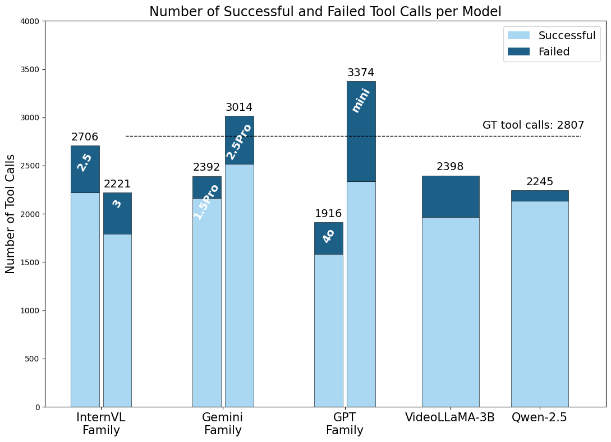
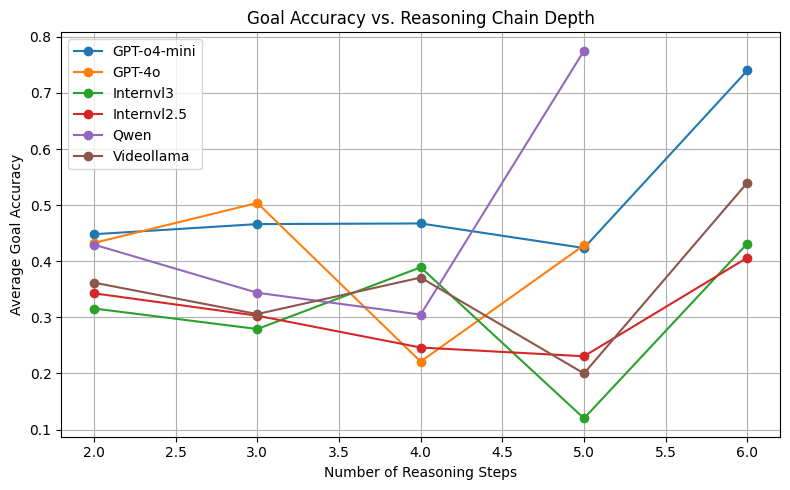
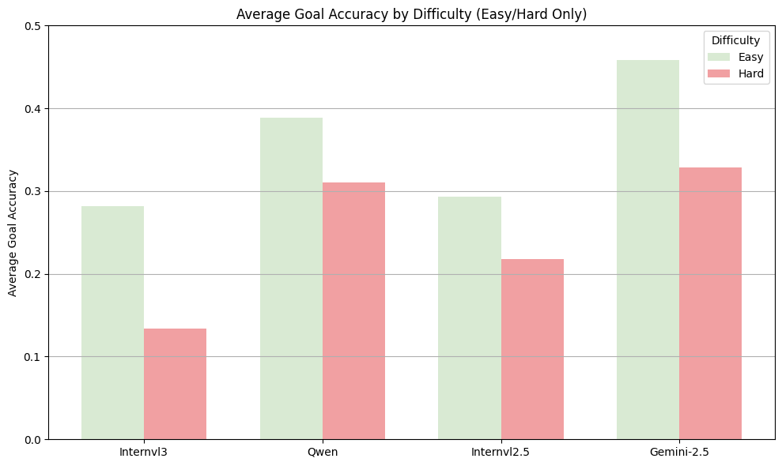

# Agent-X Evaluation Notebooks

This directory contains two Jupyter notebooks used for evaluating and analyzing the performance of models on the **Agent-X benchmark**. Each notebook serves a distinct purpose in the evaluation pipeline.

---

## 1. `metrics.ipynb`: Evaluation Metrics Computation

This notebook performs **quantitative evaluation** of model performance on the Agent-X benchmark, focusing on reasoning accuracy, tool usage correctness, and outcome quality.

It is structured to compute and visualize:

- Goal Accuracy
- Tool Metrics for Generative Queries
- Tool Call Success/Failure
- Reasoning Step Trends
- Difficulty-based Breakdown

---

## Goal Accuracy Computation

The notebook begins by computing **goal accuracy (G<sub>acc</sub>)** for each example.

### Step 1: Filter Generative Queries

We exclude generation-based examples (`GENERATIVE_IDS`) when computing the global goal accuracy because they follow a different evaluation scheme.

```python
# Clear goal_accuracy for generative rows
df.at[idx, "goal_accuray"] = ""
```

### Step 2: Global Average Accuracy

After filtering, the notebook computes the average `goal_accuray` across the rest of the dataset for a reliable benchmark.

### Step 3: Goal Score ★ for Generative Subset

Since generative queries don't have ground-truth answers, we approximate their goal success by averaging the following tool-based scores:

- `precision_score`
- `tool_accuray`
- `toolset_accuray`

This forms the **G<sub>a</sub><sup>*</sup> (Goal Accuracy Star)** metric.

```python
subset_means = {
    "precision_score": ...,
    "tool_accuray": ...,
    "toolset_accuray": ...
}
```

---

## Tool Call Statistics

We analyze how often tools were used successfully or failed across different models. This helps uncover issues like:

- Missing tool outputs
- Missing tool names
- Invalid tool calls

### Allowed Tool List

```python
allowed_tools = {
    "Calculator", "OCR", "ObjectCounter", "SceneDescriber",
    "WebSearch", "RegionDescriber", "LocateObjectByText",
    "CodePlotter", "MathOCR", "Solver", "DrawBoundingBox",
    "OverlayText", "ImageGenerator", "ImageStylization"
}
```

### Bar Chart: Tool Call Success vs Failures

<div align="center">
 
</div>


---

## Tool Usage Summary

For each JSON file of reasoning traces, the notebook extracts:

- Total reasoning steps
- Unique tools used
- Tool usage distribution

Saved as a `*.csv` file to compare models and enable trend plots.

```python
{
    "id": 43,
    "total_steps": 5,
    "unique_tools_used": 3,
    ...
}
```

---

## Trend: Goal Accuracy vs Tool Count / Step Depth

This part plots how reasoning **depth** and **tool diversity** affect performance.

```python
compare_models_goal_accuracy_trends([...])
```

### Goal Accuracy vs. Reasoning Steps

<div align="center">
 
</div>

---

## Difficulty-wise Goal Accuracy (GPT-4o Categorized)

We use a GPT-4o-generated categorization of query difficulty (`easy`, `medium`, `hard`) to plot how well models perform on hard vs. easy tasks.

```python
grouped = df.groupby("difficulty")["goal_accuray"].mean()
```

### Accuracy by Difficulty

<div align="center">
 
</div>


---

## Summary

This notebook provides:

- A principled way to **isolate evaluation** of generative and non-generative queries
- Insights into **tool usage effectiveness**
- Trend analysis on **reasoning depth** and **difficulty**
- Exportable CSVs for further aggregation or leaderboard integration


## 2. `error_analysis.ipynb`: Common planning, formatting, and reasoning mistakes of models on Agent-X

This notebook supports **qualitative evaluation** of reasoning traces generated by vision-language models in the Agent-X benchmark. It focuses on identifying specific types of **reasoning failures** through structured keyword-based comparisons.

---

## Error Types Evaluated

The notebook provides modules to diagnose two high-level failure modes:

### 1. Misinterpreting Visual Content
- Detects errors in final answers where key visual details are missing or incorrect.
- Uses keywords extracted from ground truth (GT) final answers + justifications.

### 2. Incorrect Spatial Reasoning or Logical Sequencing
- Evaluates if reasoning traces reflect correct tool use, spatial awareness, and intermediate logic.
- Uses keywords extracted from GT reasoning steps.

---

## Method: Keyword-Based Mismatch Detection

We define **ground truth (GT) keywords** using `spaCy` (noun chunks, object names, concepts) and check if these appear in model predictions.

```python
nlp = spacy.load("en_core_web_sm")
doc = nlp(text)
keywords = [chunk.text.lower().strip() for chunk in doc.noun_chunks if 1 < len(chunk.text) < 30]
```

---

## Module 1: Final Answer Keyword Matching

Extracts up to 21 keywords from GT final answers and their justifications (`data.json`), and checks if each is present in model predictions.

### Output Report
```json
{
  "gt_keywords": ["green helmet", "kid", "left side"],
  "pred_text": "There is a boy on the right wearing blue...",
  "matched": ["kid"],
  "unmatched": ["green helmet", "left side"],
  "match_count": 1
}
```

### Scoring
- A prediction is considered failed if `match_count < 1`.

---

##  Module 2: Reasoning Step Keyword Matching

Extracts up to 21 keywords from GT reasoning traces and checks if they appear in the predicted tool-use trace.

### Fields Compared
- `task`, `tool`, `output`, `thought`

### Report Structure
Same as Module 1 but for reasoning traces instead of final answer.

---

## Binary Scoring

For each model:
```python
compute_binary_score(pred_report, "model_name")
```
Prints how many examples had **zero** matching keywords (complete mismatch), helping quantify how often the model entirely misses key concepts.

---

## Requirements

Install dependencies before running:

```bash
pip install spacy==3.5.4 --user
python -m spacy download en_core_web_sm
```

---

## Summary

This notebook provides:

- A principled way to **quantify model hallucinations** or omissions
- GT-aligned keyword extraction for **final answers** and **reasoning traces**
- Binary error signal for **systematic failure detection**
- Easily extendable to new categories (e.g., tool misuse, factual inconsistency)

---

